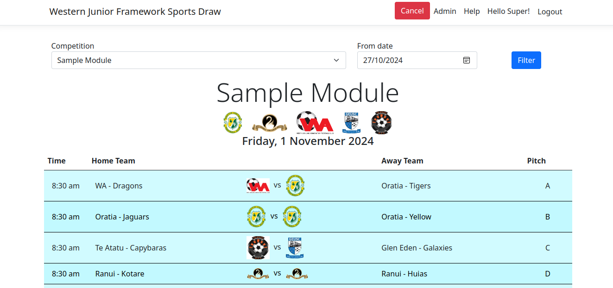

# Administrators Quick Ref

## Login

1. Click Login from the top navigation bar.
2. Use the details provided to login.

## Setup/Alter Teams
1. Login
2. Click Admin from the top menu
{ style="border: 1px solid darkgray;" }
3. Click *Manage* in the Team tile
4. Refer [Teams](teams.md) for adding teams.

!!! Note

    Rather than removing teams, use the "Include in Draw" toggle to remove them
    from the draw.  This will remove them from future generated draws but will
    leave them as the current name, for the previous draws.  If you just rename
    the team (also valid if their name changes) then the name will change on all
    previous draws too.

## Generate Draw
1. Login
2. Click Admin from the top menu
{ style="border: 1px solid darkgray;" }
3. Click *Draw* in the `Generate Draw` tile

## Cancel Draw
1. Login
2. Find the draw for the module/day you want to cancel.
3. Click Cancel in the top nav bar. 

!!! Note

    The cancel button won't show if you don't have permission to administrate 
    the module.

{ style="border: 1px solid darkgray;" }

