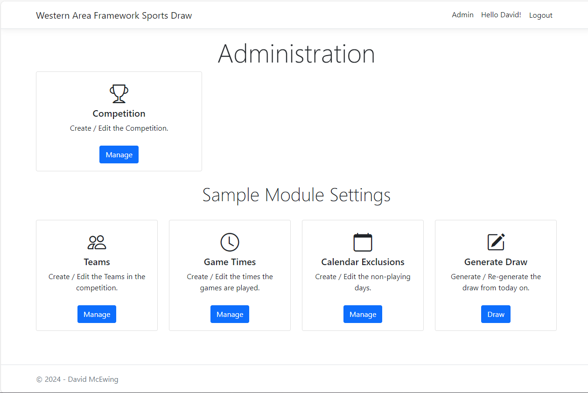
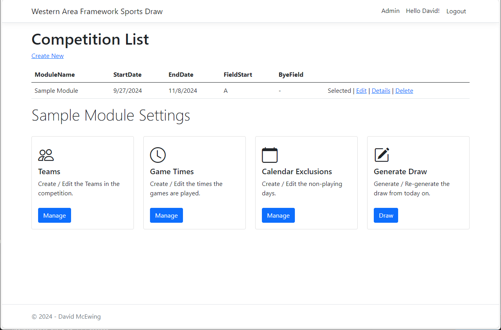

# Competitions

The competition is the container that holds all the settings relating to the draw, this includes:

  * Start and End dates for the draw
  * Fields to be allocated
  * [Times](times.md)
  * [Teams](teams.md)
  * [Calendar Exclusions](noplaydays.md) or Non-playing days

{ style="border: 1px solid darkgray;" }

## Managing Competitions

From the Admin page click Manage in the competitions card, this will take you to a page where you can create and edit competitions.

{ style="border: 1px solid darkgray;" }

`Create new`

:    Creates a new Competition

`Select/Selected`

:   Indicates/Sets the default competition that you as a signed in user is working with, this will be reflected in the lower
    half of the screen.

`Edit`

:   Edits the competition, this will also set the competition as default for you, (see above)

`Details`

:   A read only view of the competition.

`Delete`

:   Deletes the competition... this will likely error... so just don't click it.

## Competition Properties

|Field| Description|
|-----|-------|
| Start Date | The first date for the competition.  This day will set the day of the competition, i.e. if it is a Friday, the draw will be done for every Friday until the end date.
| End date | The final date for the competition.  No draw will be created for a date after this date.
| First Field | When allocating fields, this is the first designation... i.e. 'A', could be 'C' for Parrs Park turf.
| Field for Bye games | This is the marking for the field allocated to Byes. Any character can be used.
