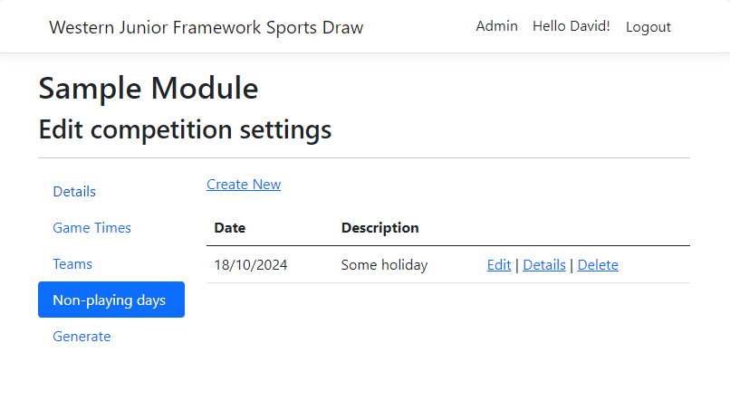
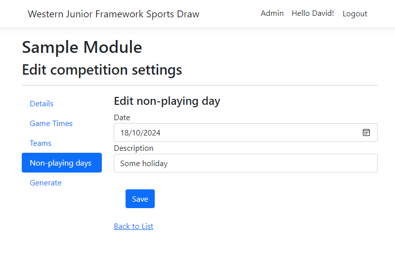

# Non-playing days

The non-playing days are days that are between the start and end date of the competition, however, there is no competition on that day.  I.e. the middle
weekend of the school holidays.

{ style="border: 1px solid darkgray;" }

## Managing Non-playing days

From the Admin page click Manage in the Non-playing days card, or from the same tile in the Competition page, this will take you to a page where you can create and edit the non-playing days for the competition.

`Create new`

:    Creates a new no game day.

`Edit`

:   Edits the no game day details.

`Details`

:   A read only view of the team.

`Delete`

:   Removes the non-playing day.

!!! Note

    After editing the no play days, the draw should be regenerated.

## Non-playing day Properties

{ style="border: 1px solid darkgray;" }

| Field | Description |
|----|------|
| Date | The day to be remvoed from the draw.  E.g. the non-playing day. |
| Description | This is just a note for the day, so when editing it later you know what it is/was for. |
