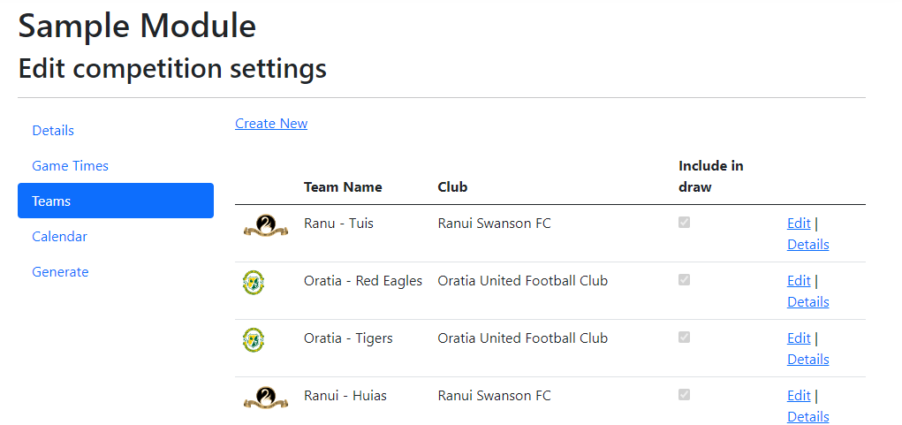
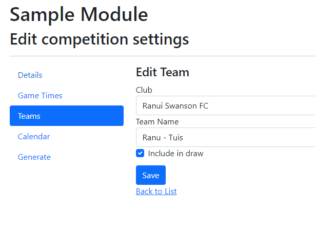

# Teams

The teams are, obviously, the teams playing in the competition.  It is not possible to delete a team as that would change
the draw when redrawn for games that are in the past.  Instead there is a check box to include the team in the draw.  This can be used to "delete" the team.

{ style="border: 1px solid darkgray;" }

## Managing Teams

From the Admin page click Manage in the Teams card, or from the same tile in the Competition page, this will take you to a page where you can create and edit the Teams for the competition.

`Create new`

:    Creates a new team.

`Edit`

:   Edits the team details.

`Details`

:   A read only view of the team.

!!! Note

    After editing the teams the draw should be regenerated.

## Team Properties

{ style="border: 1px solid darkgray;" }

| Field | Description |
|----|------|
| Club | (Select List) The club the team is playing for. This will specify the logo, used to represent the team. |
| Team Name | The name of the team on the draw.  Note: Because the club is only shown by logo on the draw, a short name for the club may want to be included in the name. |
| Include in draw | Check to include them in the draw.  If unchecked they will not be included when generating the draw. |
