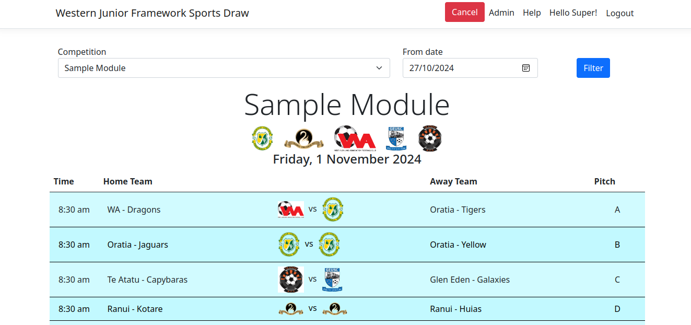

# The Draw

{ style="border: 1px solid darkgray;" }

The main page of the site is the draw.  The top bar only has those features
when the user is signed in.

The filter allows the selection of the competition and the date to see. It
is assumed that there is only one day of games per week for each competition.  The
date searched is a week around the next Saturday, this means that the search should
always find the next game day, assuming the week isn't a non-playing week. 

`Cancel/Uncancel`

:   Assuming the user is signed in, and has admin rights for the competition being
    shown, then this red button will show `Cancel` or `Uncancel`.  This will cancel
    all the games shown.  There is no prompt before Cancelling.  However, it is just
    as fast to restore the previous state.
    
    When the games are cancelled they will show as cancelled on the draw.

`Printing`

:   A slight different CSS is applied when printing.  The print CSS tightens the 
    display so that it prints nicely on an A4 page.

    For best results for printing the `Headers and Footers` should be unchecked,
    and `Background graphics` should be turned on to get the colour bandings applied
    on screen.

`QR Code`

:   The QR code on the bottom of the page contains a link back to the website with
    the filtering applied.