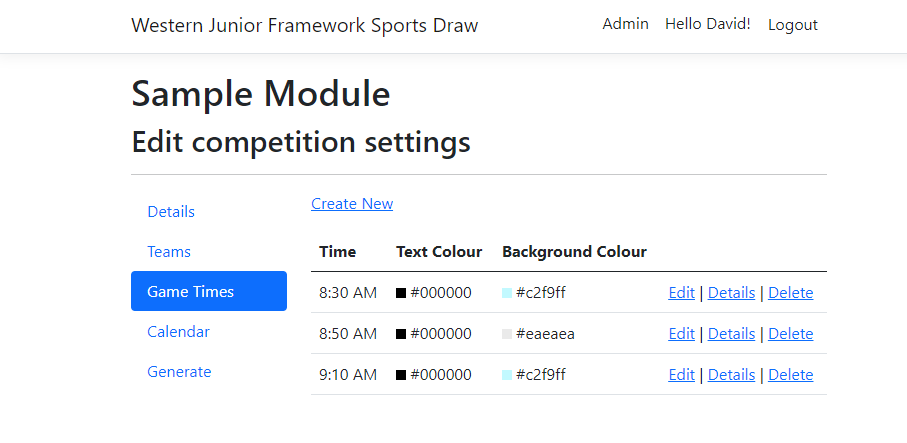
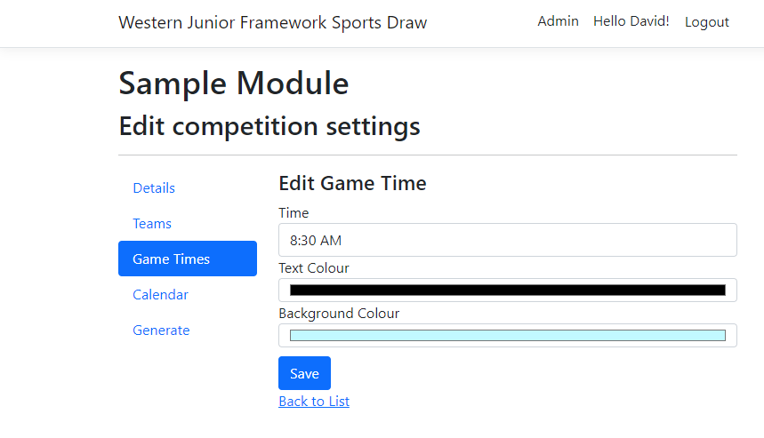

# Game Times

The games times are the times that games are played on the playing day. They can also be given a unique colour look
when it is displayed on the draw.

{ style="border: 1px solid darkgray;" }

## Managing Game Times

From the Admin page click Manage in the Game Times card, or from the same tile in the Competition page, this will take you to a page where you can create and edit the game times for the competition.

`Create new`

:    Creates a new time slot.

`Edit`

:   Edits the time slot.

`Details`

:   A read only view of the time slot.

`Delete`

:   Deletes the time slot.

!!! Note

    After editing the game times, the draw should be regenerated.

## Game Time Properties

{ style="border: 1px solid darkgray;" }

| Field | Description |
|----|------|
| Time | The time the game starts |
| Text Colour | The colour for the text on the Draw for this time slot. |
| Background Colour | The colour for the background on the Draw for this time slot. |

!!! Warning

    Check that the colours work by looking at the draw, and make sure they are still legible.
