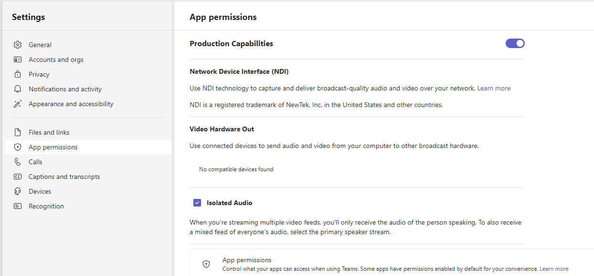

# Microsoft Teams in your Production

Occasionally we have the need to call (video or voice) a person into our service structure, both
online and live in the venue.  This is definitely easier than when we had to build custom hardware
to interface our sound system to the sound system.  My preference now is to use [Microsoft Teams](https://teams.microsoft.com/) as it has [NDI](https://ndi.video) capabilities built in.  At least
it can send NDI feeds.  Linking our live cameras back is a little tricker but not hard.

!!! note
    The best place for the setup of this is documented on vMix's website under [How to add Microsoft Teams via NDI to your vMix production](https://www.vmix.com/knowledgebase/article.aspx/278/how-to-add-microsoft-teams-via-ndi-to-your-vmix-production).  This post will walk through additional information I've found useful when setting up in our productions.

!!! note
    As of vMix 27 (released 22 January 2024) Zoom meetings has been integrated in.  So you have the option of that as well as what is documented here.

## Our Setup

First lets just review the setup.  I say review because I intend to detail this later, so come back later for that.  This is just a brief summary.

The heart of our system is the Video Production computer.  This computer has been setup with:
* **BlackMagic DuoLink Pro** - for SDI Capture & Rendering
* **Dante Virtual Sound card** - for Audio capture and sending
* **vMix** - For the heart of the processing.

### Cameras
We have two manned cameras on tripods and one BirdDog P100 remoted controlled.  The manned cameras supply SDI feeds while the BirdDog comes in via NDI.

### Audio
Audio is sent and received to/from the Sound Desk via the Dante Audio network.

## Teams Video in vMix
This is the easy part.  Just enable NDI feeds in Teams and start broadcasting (see below).  This 
will put a variety of NDI feeds onto your network that can be picked up easily using vMix's NDI
input option.  The only difficult part is that the feeds you want to use won't be available until
the person is in the meeting, so be prepared and ready for this.  vMix provides the ability to 
select the NDI feed with a right-click context menu on the NDI input, so as long as you have the
enough NDI inputs loaded this shouldn't be too much of a hassle.

Audio should be selected carefully if you are using a seperate computer to host the Teams meeting,
which I would recommend to distribute CPU load (I use budget computers).  Ensure that the feeds
from Teams do not include a copy of the output that you are trying to send to your streams.  I
use the audio from either the `Primary Speaker` feed or from the `Individual Speakers`.

## vMix output in Teams
From inside vMix we use the Output Input mixed with our camera feeds into a four quadrant layout.

This layout is then set on the Output 4 and NDI is enabled on this Output, with Audio Bus A.  This NDI feed is then captured using the NDI webcam tool and used as the camera and audio feed for Teams.

## To and From Sound desk
The Sound is transmitted through the Dante network.  We receive two channels from the sound desk (1 & 2) which we use in the mix, the feed from the sound desk excludes anything that we send to the sound desk.

Cause of course we send Audio Bus B to the Dante network on channels 3 & 4.

This means our audio mix is as follows:

# Teams NDI feeds available
Once setup and broadcasting Teams will transmit the [following NDI feeds](https://support.microsoft.com/en-us/office/broadcasting-audio-and-video-from-microsoft-teams-with-ndi-and-sdi-technology-e91a0adb-96b9-4dca-a2cd-07181276afa3).

`Primary speaker`
:   A stream will be generated that automatically switches to whoever is actively speaking from all of the incoming streams. (Audio/video from your own computer won't be included.)

`Local`
:   A stream will be generated of the audio/video that is being sent to the meeting from your computer. (This allows you to have the same audio/video in both the meeting and in your local NDI® production.)
    !!! danger
        This causes an audio feedback loop in our setup, so I'd strongly advise using this feed with care if at all.

`Individual users`
:   Each user will have a stream available over NDI®. The incoming audio for a meeting is mixed together and will be the same for all individual user streams. These streams will display the video at the same quality that is being received by the client.
    !!! note 
        If no video is available, you'll see a simple screen with the Teams logo. But the stream is still being received by your NDI® software/hardware.

`Screen sharing`
:   Any incoming screen sharing will be available as an NDI® stream. 

`Large gallery and Together mode`
:   Both of these modes will have their own NDI® stream available.

## Enabling NDI in "New" Microsoft Teams (Windows only)

!!! info

    The following is copied from [NDI.Video](https://ndi.video/faq/new-teams-ndi-broadcast/) a site with lots of information about NDI.

From January 2024, Microsoft has been offering a "new" version of Microsoft Teams (Version: 23335.232.2637.4844, Client version: 49/23113028724). Upon enabling it, NDI outputs will not be enabled anymore. To re-enable NDI outputs, you must now download some additional files:

Within New Teams, navigate to Settings, then App Permissions. Click the download link to install the necessary NDI files from Microsoft.

Run the Program that is downloaded (ndi-win-x64_vs2022-crtdynamic-release.msix)

Once it's installed, enable NDI in the App Permissions

Now, when a call is made and connected, NDI will need to be enabled on a per-call basis. During the call, navigate to More, then Streaming, then Broadcast over NDI

The NDI Feed can now be pulled up on any capable NDI receiver.
