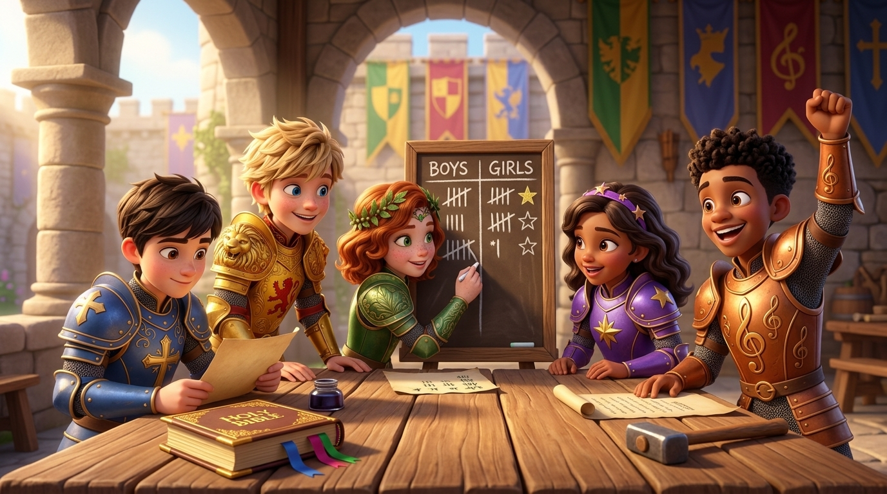

# Knight Force: Bible Sword Challenge Point Tally Session

**Date:** 2026-09-10  
**Context:** Pentecostal Children's Ministry Curriculum (Ages 5–10)  
**Event:** Force 10 Bible Sword Challenge – Score Tallying  
**Generated Asset:** `knights_tallying_scores.jpg`

---

## 1. User Request & Prompting

### Original User Prompt
> *"Leo and Mia along with the other knights have completed running the Bible Sword Challenge betweens the boys and girls of "Force 10". They are now tallying the scores. Can you please draw the scene? Include only the knights in the image, no other boys or girls are needed."*

### Detailed Generation Prompt

> 3D animated movie style, Disney Pixar aesthetic, highly detailed CGI render. The five young hero knights of Knight Force are gathered together around a rustic wooden table in a sunlit medieval castle pavilion to tally the scores of the "Bible Sword Challenge". Only the five knights are present in the scene, no other people or children.
>
> Characters:
>
> 1. Leo (Sir Braveheart): cheerful boy with tousled blond hair, blue eyes, wearing gleaming golden-yellow plate armor with embossed lion head shoulder pauldrons and red lion heraldry, smiling as he leans forward against the table.
> 2. Mia (Lady Kindness): gentle girl with wavy auburn hair, freckles across her nose, green eyes, wearing a crown of green leaves with a center gem and engraved leafy green armor, happily writing tally marks with chalk on a wooden scoreboard.
> 3. Ben (Sir Truthful): thoughtful boy with neat dark brown hair and brown eyes, wearing royal blue armor with a golden cross emblem on the chest, carefully reviewing a parchment scroll alongside an open leather-bound Bible on the table.
> 4. Chloe (Lady Faith): sweet girl with warm brown skin, wavy dark hair with a purple star headband, wearing royal purple armor with golden star emblems, watching the scoreboard with an excited, supportive smile.
> 5. Sam (Sir Joyful): enthusiastic boy with brown skin and curly black hair, big bright smile, wearing bronze-orange armor engraved with musical treble clefs, raising his hand in joyful celebration.
>
> Environment & props: On the table is a wooden scoreboard chalkboard with two columns labeled 'BOYS' and 'GIRLS' filled with chalk tally marks and stars, an open gilded Holy Bible with bookmark ribbons, parchment scrolls, and inkwells. In the background are sunlit stone castle arches, stone pillars, and colorful heraldic banners. Warm cinematic lighting, uplifting, wholesome Christian children's ministry atmosphere, 8k quality, vibrant colors.

---

## 2. Creative Thinking & Design Rationale

### Theological & Curriculum Context

* **The "Bible Sword Challenge":** A staple in Pentecostal children’s ministry (classic Bible drill), derived from **Hebrews 4:12** (*"For the word of God is alive and active. Sharper than any double-edged sword..."*) and **Ephesians 6:17** (*"the sword of the Spirit, which is the word of God"*). The children of "Force 10" (the 5–10 age group) compete in locating scriptures quickly and reciting God's Word.
* **Knight Force Role:** The knights act as mentors, adjudicators, and encouragers rather than distant figures.

### Character Design & Role Consistency

Based on `characters.md` and `profile_avatar.md`:

* **Mia (Lady Kindness):** Gentle, encouraging healer. Assigned to mark the chalkboard with chalk so her warmth is centered. Fitted in her signature leafy green plate armor, emerald crown, and freckled smile.
* **Ben (Sir Truthful):** Bearer of the "Royal Code" and absolute integrity. Assigned to carefully check the scripture passages and verify tally counts against an open Holy Bible and scroll to ensure true, fair scoring. Dressed in his cobalt blue plate armor with the gold cross.
* **Leo (Sir Braveheart):** Energetic leader. Leaning over the table with hands braced, anticipating the outcome with an infectious, confident grin in his lion-embossed golden armor.
* **Chloe (Lady Faith):** The visionary/navigator. Beaming with an encouraging smile in her purple armor with golden stars and matching star headband.
* **Sam (Sir Joyful):** The worship leader/musician. Pumped with excitement, raising his arm in joyful celebration in his bronze armor with musical treble clef engravings.

### Composition & Constraint Adherence

* **Exclusion of Extra Children:** Strictly limited the characters in the frame to the 5 official knights, keeping the focus intimate and character-driven.
* **Art Style:** 16:9 cinematic widescreen in the high-fidelity 3D CGI animation style (Pixar/Disney/DreamWorks aesthetic), matching the pre-existing 3D avatars (`SirBraveheart_3D_Profile.jpg`, `Mia_3D_Profile.jpg`, `Chloe_3D_Profile.jpg`).
* **Environment:** A bright, sunlit medieval pavilion featuring stone arches, rustic wooden furniture, ink pots, parchment scrolls, and heraldic banners representing the virtues of the Kingdom.

---

## 3. Results & Final Output

### Key Scene Details

* **The Chalkboard Scoreboard:** Sits at the center of the wooden table with columns clearly marked **"BOYS"** and **"GIRLS"**, showing close tally hash marks and reward stars.
* **The Holy Bible:** An open, gold-embossed edition with colorful bookmark ribbons sits prominently on the table before Sir Truthful.
* **Heraldic Banners:** Hanging behind the knights in the courtyard arcade, displaying the lion (Leo), leaf (Mia), cross (Ben), and treble clef (Sam).
* **Saved File Path:** `knights_tallying_scores.jpg` (stored locally in the `KnightForce` workspace).
