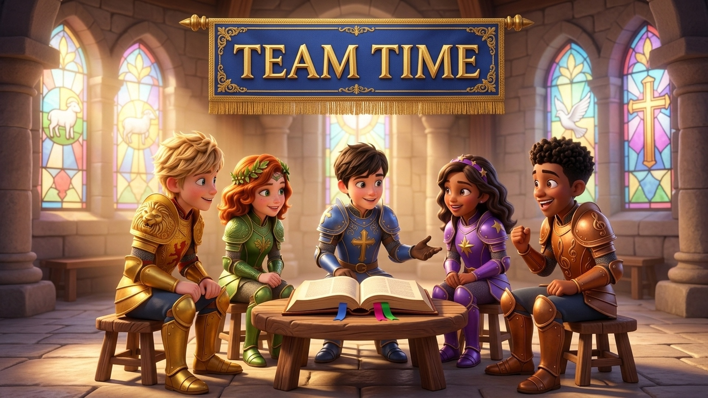

# Knight Force: "Team Time" Screen Graphic & Session Guide

**Date:** 2026-09-17  
**Context:** Pentecostal Children's Ministry Curriculum (Primary School, Ages 5–10)  
**Program Segment:** Team Time (Small Group Breakout following Ben & Chloe's Teaching)  

---

## 1. Ministry Context & Purpose

### What is "Team Time"?
In the Knight Force ministry flow, **Team Time** is the vital small-group application segment that takes place immediately after the large-group teaching presented by **Ben (Sir Truthful)** and **Chloe (Lady Faith)**.

While the platform teaching sets the theological foundation, **Team Time** allows children to:

* **Huddle into Small Teams:** Groups of 4–7 children gather with their designated team leader/coach.
* **Process & Discuss:** Unpack the message delivered by Ben and Chloe in an age-appropriate, relational setting.
* **Open the Scriptures:** Directly explore Bible verses together to build biblical literacy.
* **Pray & Minister in the Spirit:** Encourage personal reflection, voice prayer requests, and pray for one another under the guidance of the Holy Spirit.

### Purpose of the Screen Display Graphic

During this active 10–15 minute segment, the sanctuary or ministry room transitions from front-facing presentation to interactive group circles. This **1080p widescreen graphic** remains projected on the main display screens to:

1. Provide a clear visual cue that the room is in "Team Time".
2. Set a warm, cozy, and reverent atmosphere of fellowship.
3. Model positive group discussion dynamics through the Knight Force characters.

---

## 2. Generation Prompt & Parameters

### User Request

> *"After the teaching segment given by Ben and Chloe we break into smaller teams for a discussion around the topic presented. We call this time 'Team Time'. We need a 1080p resolution JPG file featuring the knights to put on the screen during this period. Create the image and document this prompt and all thinking and results in a teamtime.md markdown file."*

### Detailed Image Generation Prompt

> 3D animated movie style, Disney Pixar aesthetic, ultra-detailed CGI render. A vibrant and welcoming widescreen 16:9 graphic for children's church presentation screen. At the top of the scene, an ornate royal golden-embroidered heraldic banner boldly displays the clean 3D carved title text 'TEAM TIME'. Below the title, the five young hero knights of Knight Force are gathered in an engaging, cozy circular small-group discussion circle inside a sunlit castle hall. Ben (Sir Truthful) in royal blue plate armor with a gold cross emblem, and Chloe (Lady Faith) in royal purple armor with a golden star emblem and purple star headband, lead the discussion, gesturing warmly toward an open leather-bound Holy Bible on a low rustic wooden round table. Leo (Sir Braveheart) in gleaming golden lion armor leans forward listening eagerly. Mia (Lady Kindness) in leafy green armor with an emerald leaf crown smiles compassionately. Sam (Sir Joyful) in bronze-orange treble-clef armor beams with joy. The room features warm sunlight streaming through arched stained glass windows, soft ambient glow, stone castle pillars, and an inspiring, uplifting Christian kids ministry atmosphere. Perfect 1080p presentation slide layout.

### Generation Settings

* **Aspect Ratio:** 16:9 (Widescreen)
* **Visual Style:** 3D CGI Animated Feature Film (Pixar / DreamWorks aesthetic)
* **Reference Asset Used:** [`knights_tallying_scores.jpg`](knights_tallying_scores.jpg) (ensuring 100% character face, hair, and armor consistency)
* **Resampling & Target Resolution:** 1920 × 1080 (1080p Full HD) via Lanczos filter with high JPEG quality (95%) and Huffman optimization.

---

## 3. Creative Thinking & Theological Rationale

### 1. Character Placement & Leadership Dynamics

* **Ben (Sir Truthful) & Chloe (Lady Faith) at the Center:**
  Because Ben and Chloe presented the main teaching segment, they naturally anchor the discussion table. Ben is seated at center-left in his royal cobalt blue armor and gold cross, with hands open toward the Bible, modeling truth grounded in God's Word. Beside him sits Chloe in her royal purple armor with star accents and star headband, gesturing warmly and encouraging the team to see how God's truth applies to their lives.
* **Leo (Sir Braveheart):**
  Seated on the left bench in his golden lion-pauldron armor, leaning forward with his elbows near his knees. As the bold leader, he models active listening and humility—demonstrating that even the bravest leader stops to learn and listen.
* **Mia (Lady Kindness):**
  Seated next to Leo in her leaf-accented green armor and emerald wreath crown, looking at Ben and Chloe with a radiant, compassionate smile. She embodies safety, empathy, and kindness, encouraging kids who might feel shy or hesitant to speak up.
* **Sam (Sir Joyful):**
  Seated on the right in his bronze-orange armor adorned with musical treble clefs. He is smiling enthusiastically with an upbeat, expressive gesture, reminding children that studying God's Word and growing together is full of joy and celebration.

### 2. Setting & Symbolism

* **The Heraldic "TEAM TIME" Tapestry:**
  Suspended prominently at the top of the composition, framed by golden rods and tassels. The bold, clean serif typography ensures high legibility from across a large church auditorium or multipurpose hall.
* **The Open Holy Bible:**
  Placed in the center of the rustic round table with colorful ribbon bookmarks. This visually communicates that the Bible is the foundation and focal point of every team conversation.
* **The Stained Glass Windows:**
  Positioned in the rear castle wall, featuring stained glass art of:
  * **The Lamb of God** (gentleness, salvation, sacrifice)
  * **The Holy Dove** (the Holy Spirit—paramount in a Pentecostal ministry setting, representing the Spirit’s presence and guidance in small groups)
  * **The Cross** (Christ at the center of all wisdom and truth)
* **Warm, Sunlit Atmosphere:**
  Soft golden sunbeams flood the hall, reinforcing feelings of warmth, belonging, safety, and inspiration.

---

## 4. Results & Visual Asset

### File Asset Details
* **Filename:** [`team_time.jpg`](team_time.jpg)
* **Resolution:** 1920 × 1080 pixels (1080p Full HD)
* **Color Space:** sRGB
* **File Format:** JPEG (.jpg), optimized for presentation software (ProPresenter, EasyWorship, PowerPoint, MediaShout)

